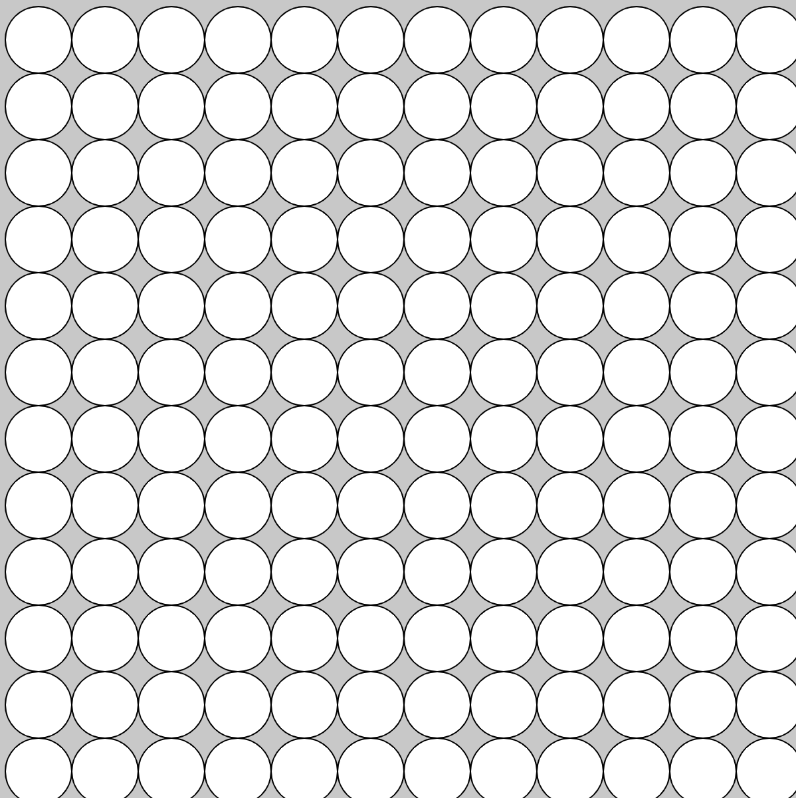

# Nested For Loops

Consider the image below



Given what we have learned so far, we would code this by saying:
```javascript
// First row
for(var x = 0; x < width; x += 50){
	ellipse(x, 50, 50, 50)
}

// Second row
for(var x = 0; x < width; x += 50){
	ellipse(x, 100, 50, 50)
}

//Repeated until you do all the rows
```

This seems rather inefficient though. Luckly, we can use **nested for loops** to quickly simplify this. For the original example, we could say:
```javascript
// Outer Loop
for(var x = 0; x < width; x += 50){
	// Inner Loop
	for(var y = 0; y < height; x += 50){
		ellipse(x, y, 50, 50)
	}
}
```
