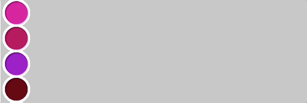

# Nested For Loops

Consider the image below


Given what we have learned so far, we would code this by saying:
```javascript
// First row
for(var x = 0; x < width; x += 50){
	ellipse(x, 50, 50, 50)
}

// Second row
for(var x = 0; x < width; x += 50){
	ellipse(x, 100, 50, 50)
}

//Repeated until you do all the rows
```

This seems rather inefficient though. Luckly, we can use **nested for loops** to quickly simplify this. For the original example, we could say:
```javascript
// Outer Loop
for(var x = 0; x < width; x += 50){
	// Inner Loop
	for(var y = 0; y < height; x += 50){
		ellipse(x, y, 50, 50)
	}
}
```

The nested loop show above would run the inner loop every time the outer loop runs a new value. For example, x would start as 0. The inner loop would then run for all values between 0 and the height drawing circles down the first column. The outer loop would then increment x up to 50 and the inner loop would repeat for the second column.

As you can see, nested iteration is highly inefficient at running commands that otherwise would take multiple for loops to accomplish.

## Tasks
For today's class, you should complete the challenges outlined below.

1. Create a grid of cricles that fills the entire canvas using nested for loops.


2. Create a grid of bullseyes similar to the one shown below. It should fill the entire canvas when executed.


3. Make an army of emojis using nested iteration. This should be the same emoji printed across the page. You can use the example below as a template or can make your own!


4. For the circle grid that you created in question 1, have it fill each circle with a random color. **NOTE**: This will look very sporadic if you keep the original frame rate. The gif below uses a frame rate of 5.


5. For the random circle grid created in the last problem, have it draw up to where your`mouseX` position is. it shouldn't draw any further than the current `mouseX`.



6. For the random circle grid created in problem 4, have it draw up to where your`mouseY` position is. it shouldn't draw any further than the current `mouseY`.


7. For the random circle grid created in problem 4, update the code such that when the mouse is clicked all of the circles will be filled with the same color. 


8. Use a next for loop to draw a pattern of triangles. You can match the drawing below or you can create your own triangle pattern. 

